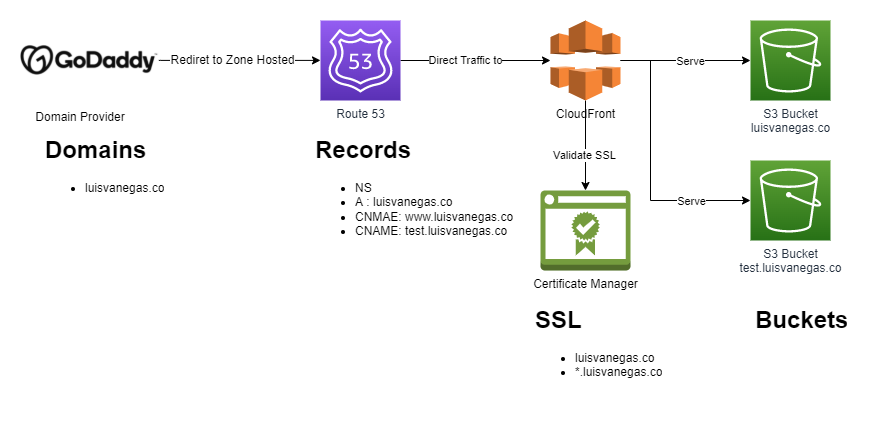
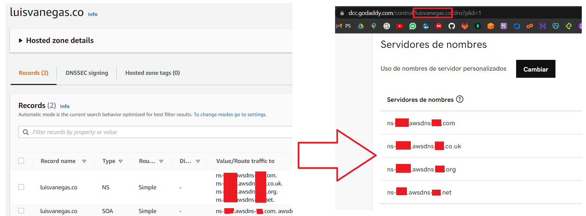
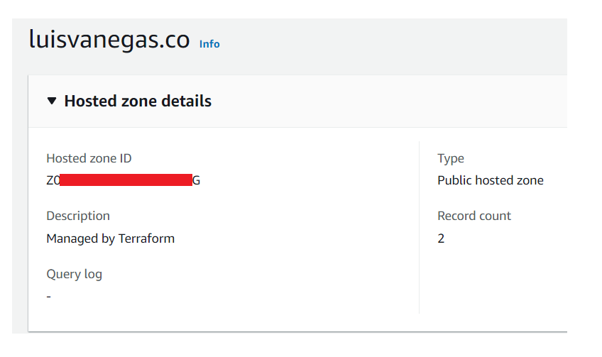

# multi-infra.tf

Multi infra in AWS 

take of: https://registry.terraform.io/providers/hashicorp/aws/latest/docs

-----

## infrastructure proposal



for the domains: `test.luisvanegas.co` and `luisvanegas.co`

-----

## Executing Local

create you hosted zone in AWS Route 53 and associate the NS records with you Domain Provider



copy HOSTED ZONE ID 



create the file in the principal path and into multi-infra path `terraform.tfvars` whit the next content:

```TF
access_key  = "<YOUR_AWS_ACCESS_KEY_ID>"
secret_key  = "<YOUR_AWS_SECRET_ACCESS_KEY>"
region      = "<YOUR_AWS_REGION>"
hz_id       = "<YOUR_AWS_HOSTED_ZONE_ID>"
```

modificate the constants and variables for `single-infra.tf`

execute in the command line:

```bash
# init
terraform init

# executing script
terraform apply -auto-approve
```

